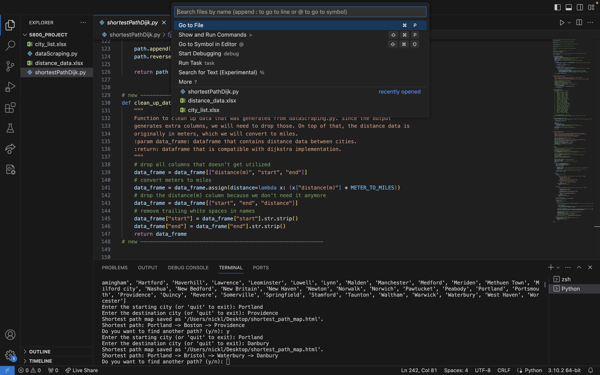
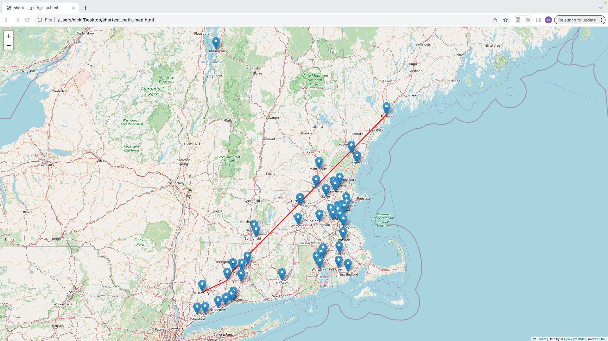

# mapWDijkstras
Ever wondered how data structures can be used in real life? This project provides a practical application for the Dijkstra's shortest algorithm implementation. This project focuses on finding the shortest path between various cities all over New England.

## Table of Contents
- [About The Project](#about-the-project)
- [Tools Used](#tools-used)
- [Contact](#Contact)

## About The Project
I have gathered location data for various cities within New England. Using datascraping, I am able to create an undirected graph that depicts how each of these cities are connected. 

It is <strong> important to note, the shortest paths depicted are not the always the shortest path in real life. </strong>  This is due to the fact we made an undirected graph to represent paths between cities. 

An example output of two cities is shown below:

## Tools Used
- Python
- Folium
- Pandas
- JSon objects

## Contact

Nicholas Letarte - letarte.n@northeastern.edu
 Project Link: https://github.com/nicholasletarte/Precipitation-Project 

